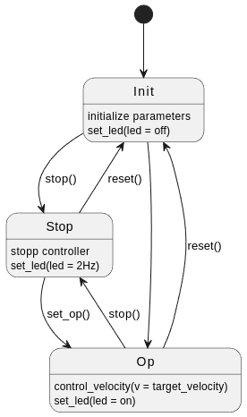
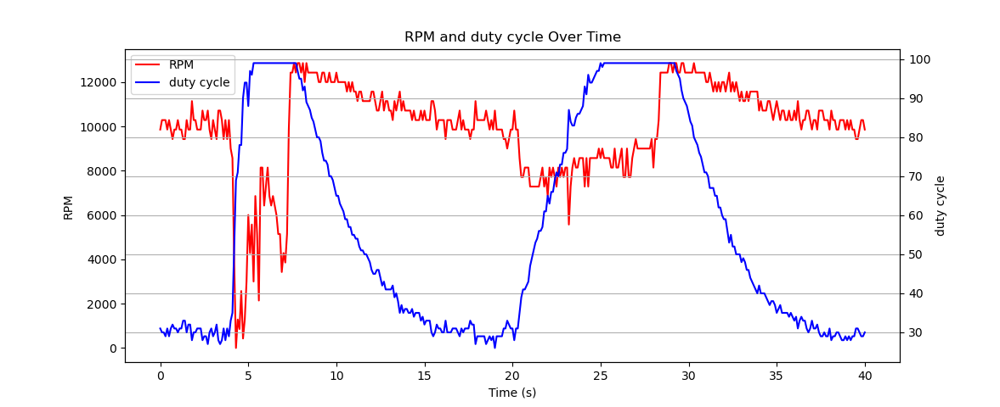

# Project 3: Dynamic controller behaviour 

## Part 1
State Diagram:  

## Part 2
State Diagram:  

Fault detection:
 - adding detection of FLT Pin

Problem: entering stop-state after reboot
With each reboot of our system, it immediately transitioned to the stop state. This fault was visualized using an oscilloscope (see image). The issue arises from a temporary loss of current, as the system requires a significant amount of electricity during startup. Consequently, an error is triggered. The state machine detects this fault and transitions directly to the stop state, even if the fault lasts only for a brief moment. The solution was to implement input debouncing, which prevents minor fluctuations from impacting our system.

CH3: Sleep pin is set high when entering the operational state  
CH4: Fault pin is driven low from the H-bridge for ~ 400 us, here the statemachine is not reacting because we have already implemented the debouncing of the FLT signal.  

CH3: Sleep pin is set low 5 ms after the FLT pin is driven low because of our 5 ms debounce time.  
CH4: Fault pin is driven low and kept low when H-bride detects a fault.  

## Part 3
The PI Controller gets 5 arguments: Kp, Ti, dt, maxOutput and minOutput. Kp and Ti are needed for the tuning of the controller, dt is needed to calculate the integral correctly and maxOutput and minOutput are there for Anti-Windup.

For testing the PI Controller we have 4 Tests: 
- test_PI_control_normal: For testing the normal functionality of the Controller.  
- test_PI_control_saturation_max: For testing the upper limit when the controller has to go above saturation mathematically.  
- test_PI_control_saturation_min: Same for the lower limit.  
- test_PI_control_windup_protection: Testing the upper limit of saturation in the special case when the integral is exceeding it.  

All tests work and pass.

## Part 4
### State Diagram:  

### Contol inputs: 
Keyboard input:   Description  
r:       reset/reinit  
p:       Change to preoperational  
t:       Enter value for Ti, only in preoperational  
k:       Enter value for Kp, only in preoperational  
v:       Change controller type to PI controller, only in preoperational  
c:       Change controller type to P controller, only in preoperational  
o:       Change to operational  

### Controller optimization:  
With Ziegler-Nichols method

#### P-Controller:  
Try different values  
Ku =  
0,2  
0,4 -- unstable (visible)  
0,6 --> best choice  
0,8   
1,56 -- strong osszilation  

calculate parameters with Ku = 0,6:  
Kp = 0,5 * 0,6 = 0,3  
Tu = 0,5  

#### PI-Controller:  
Ti = 0,83 * Tu = 0,83 * 0,5 = 0,416  
Kp = 0,45 * Ku = 0,45 * 0,6 = 0,27  
Ki = 0,54 * (Ku/Tu) = 0,54 * (0,6/0,5) = 1,2  

### Step response:   

### Load response: 
Because of the integral part of the PI controller the performace increased a lot.   

## Links
Git: https://github.com/UniRoi/Speed_controller_P2.git
Youtube: https://youtu.be/NKPbAvrN5j0?si=MElp68aFCEBPXgnk